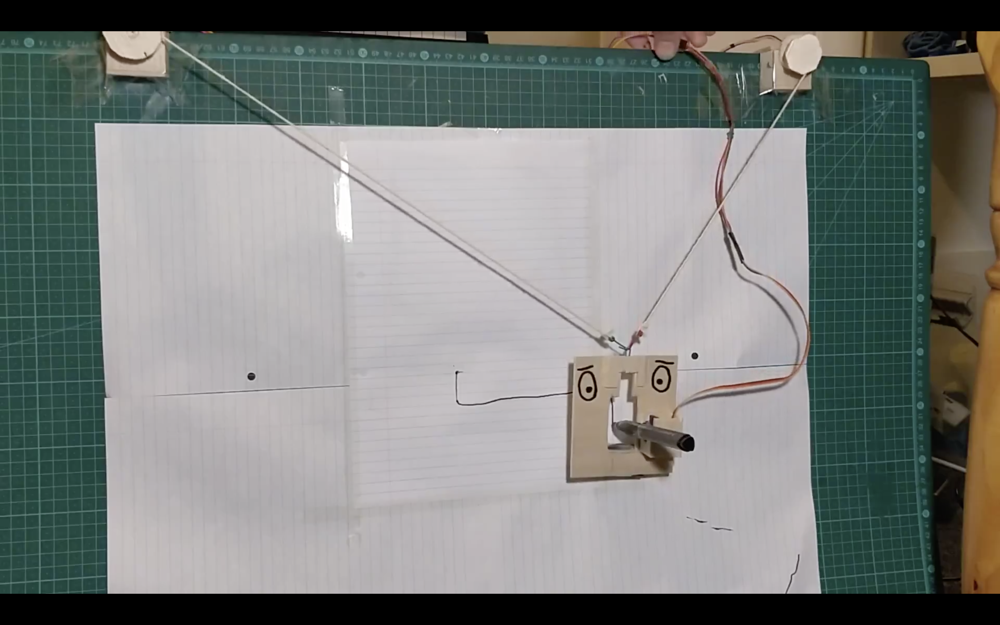
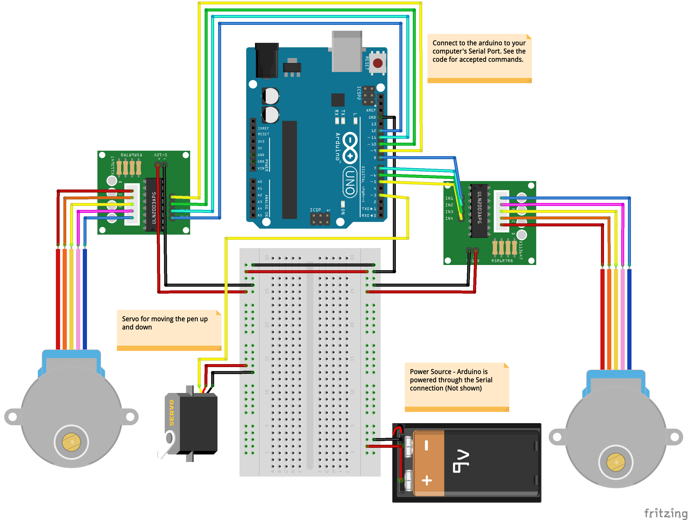

# XY Plotter - AKA PlotBot
An Arduino-based robotics project. PlotBot is anchored at the top corners of a drawing area, and then is able to move freely within the space, drawing as its silicon heart desires. 
[Youtube Video](https://youtu.be/Ub-ViXvHKfk)

## Circuit Diagram

## Features
* Can move in its drawing space when given x,y co-ordinates, despite only being able to change its position based on the distance it is from each corner
* Python wrapper which communicates through the serial port with the Arduino
* Intelligent serial port detection
