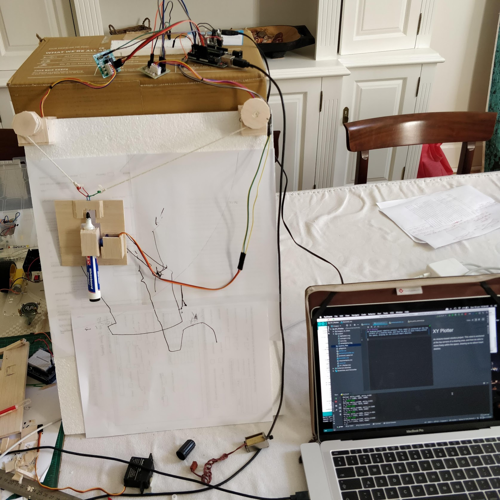
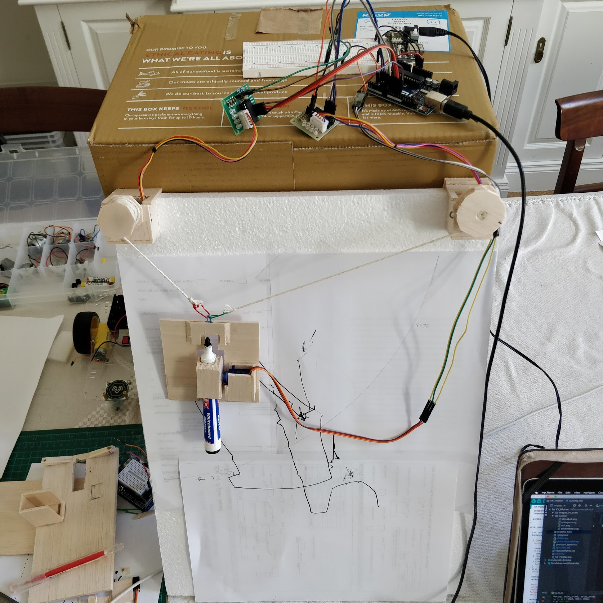

# XY Plotter
An Arduino-based robotics project. This robot is anchored at the top corners of a drawing area, and then be able to move freely within the space, drawing as its silicon heart desires. 

## Features
* Can move in its drawing space when given x,y co-ordinates, despite only being able to change its position based on the distance it is from each corner
* Python wrapper which communicates through the serial port with the Arduino
* Intelligent serial port detection
